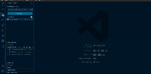
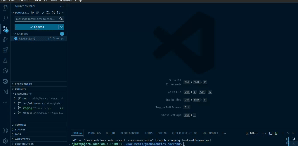
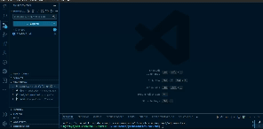

# A Step-By-Step Guide to Pushing Code to GitHub

Understanding various Git branching techniques is important. A branching technique is a strategy that helps developers and development teams coordinate their work and maintain consistency. Think of them as different strategies to playing different levels in a game. This doc will focus on just one of them which we use here in MerQri.

## Table of Content

- [A Step-By-Step Guide to Pushing Code to GitHub](#a-step-by-step-guide-to-pushing-code-to-github)
  - [Table of Content](#table-of-content)
    - [The GitHub Flow: An Overview](#the-github-flow-an-overview)
      - [Steps to pushing to GitHub](#steps-to-pushing-to-github)
        - [Note](#note)

### The GitHub Flow: An Overview

So what's the GitHub Flow branching technique? It is a lightweight, branch-based workflow that is specifically designed for teams and projects that deploy regularly. It is based on the concept of short-lived branches and emphasizes simplicity and flexibility.

In this branching technique, the `main` branch is reserved for production. However, we have tweaked the branching techinque slightly to fit our specific needs by also creating `dev` and `staging` branches that allow us to test and configure changes from our various local environment in preparing for deployment.

We create branches for features in this pattern: `feature/add-new-feature`, and they are usually deleted after the branch has merged with the `dev` branch. Merges are done through pull requests, which are reviewed before the feature is implemented.

#### Steps to pushing to GitHub

- You've been assigned a team and followed the instructions to access your repository as stated in the [README](README.md) file. The next natural step would be for you to create a specific branch for your feature.

- Within this branch, you can work on your feature or fixes after which you create a pull request for the changes to be merged in the `dev` branch.
- The code is reviewed and if it passes the review, then the code is pushed to the `dev` branch, where it is further tested within the developer environment.

- Now, the feature works in `dev` but that not all. Sometimes, a feature might need to be tested with production-level variables or secrets. So, we push the changes to the `staging` branch which is basically a sandbox simulating the production environment using a pull request.

- The code is once again pushed using a pull request and reviewed. Once the code has been reviewed, it is merged with the `main` branch where it triggers the CI/CD pipeline.

##### Note

To see the pull requests inside VS Code, go to the Extension Marketplace and install the GitHub Pull Requests extensions
